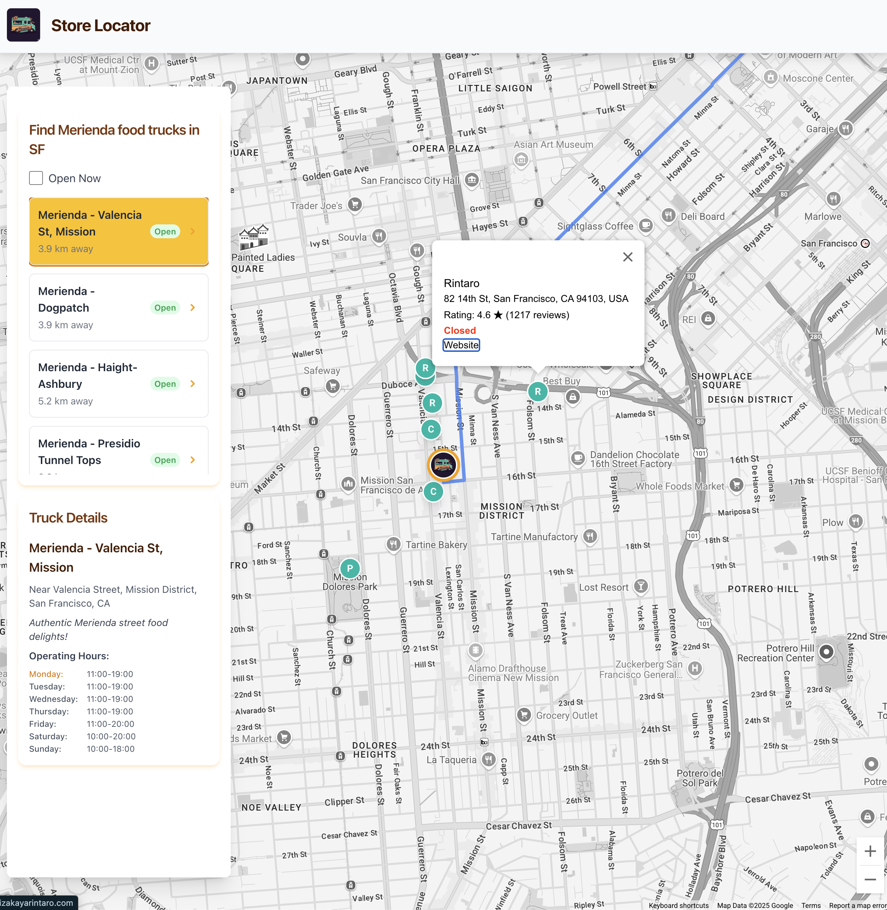

# Google Maps Platform Web Examples

Welcome to the Ryan's examples using Google Maps Platform repository! This collection showcases various common application architectures and inspires developers building modern, interactive web applications using the Google Maps Platform. These are not associated with Google Maps Platform - they are my own examples I'm sharing personally with developers.

## Purpose

The goal of this repository is to provide practical, runnable examples demonstrating best practices and common patterns for integrating Google Maps Platform APIs into web projects. Each example focuses on a specific use case or combination of APIs.

## Technology Stack

These examples primarily utilize:

*   **Vanilla JavaScript (ES2020+):** Leveraging modern JavaScript features like `async/await` and modules.
*   **Google Maps Platform JavaScript API:** Using modern loading techniques (`google.maps.importLibrary`) and features like Advanced Markers, Web Components (where applicable), and integration with Places API (New) and Routes API.
*   **Tailwind CSS:** For utility-first styling via CDN.
*   **Vite:** (Used in some examples like Store Locator) for frontend tooling and development server.

## Examples

Each example resides in its own directory and includes a specific `README.md` with setup and usage instructions.

1.  **[Store Locator](./store-locator/)**: A classic store locator pattern featuring:
    *   Displaying multiple locations (food trucks) on a map.
    *   User location finding and display (conditional based on proximity).
    *   Calculating and displaying routes from the user to a selected location (using Routes API).
    *   Fetching and displaying nearby Points of Interest (using Places API New).
    *   Filtering locations (e.g., "Open Now").
    *   Using Advanced Markers with custom content.
    *   Integrating the Place Details Web Component (`<gmp-place-details>`).

*(More examples will be added here as the repository grows.)*

## Getting Started

1.  Clone this repository.
2.  Navigate into the specific example directory you are interested in (e.g., `cd store-locator`).
3.  Follow the instructions in that example's `README.md` file to install dependencies and run the application.

## Contributing

Contributions are welcome! Please see the [CONTRIBUTING.md](./CONTRIBUTING.md) file for general guidelines. Specific examples may also have their own contribution notes in their respective `README.md` files.