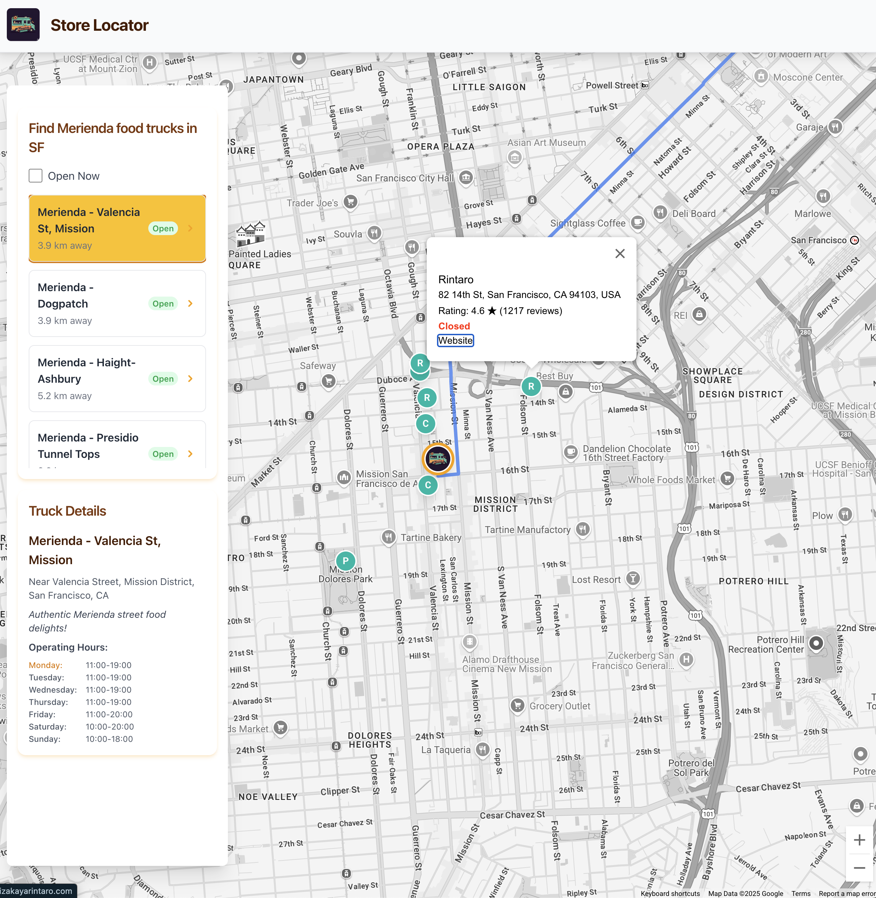

# Store Locator

A web application to locate stores using Google Maps Platform.

## Setup

1.  Clone the repository.
2.  Navigate to the `store-locator` directory (once renamed).
3.  Install dependencies:
    ```bash
    npm install
    ```
4.  **Create Environment File:** Copy the `.env.example` file to a new file named `.env`.
    ```bash
    cp .env.example .env
    ```
5.  **Add Credentials:** Open the `.env` file and add your Google Maps API Key and Map ID obtained from the Google Cloud Console.

## Running the Application

To start the development server (which uses the credentials from your `.env` file):

```bash
npm run dev
```

This will typically open the application in your default browser at `http://localhost:5173` (or the next available port).

## Building for Production

To create a production build:

```bash
npm run build
```

The output will be placed in the `dist` directory.